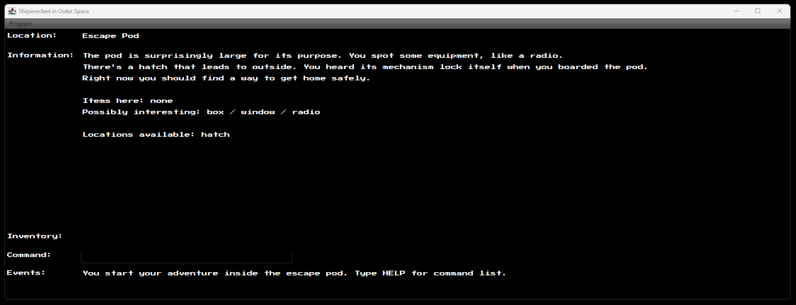
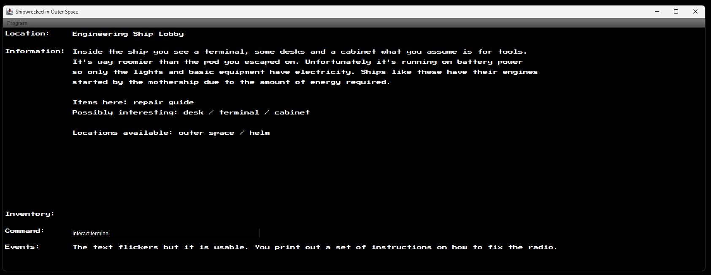
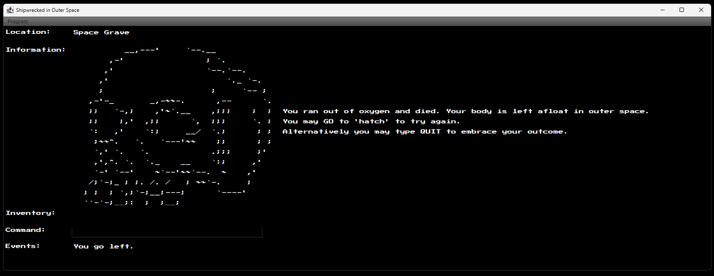
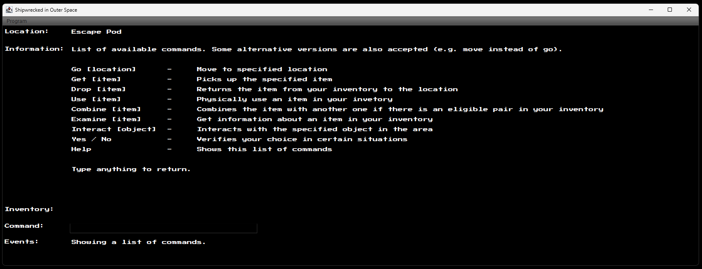

Project from 2020 made for a solo game jam as a part of a university programming course, received full points.

-----

# Shipwrecked in Outer Space: A Text Adventure

You're a noname maintenance employee for Northernmost Lane Co., a well-known space transportation company.
You were sent to operate on a model S490 medium-sized ship that had broken down a few days into its route.
As you approached the ship you noticed that it was visually in good condition, no obvious faults to be seen.
While boarding the ship, the crew mentioned that the power had simply gone out for no apparent reason.
You felt like something was off.

Step into this old school text adventure that has you scrambling to find a way back home after a disaster
occurs onboard a ship you were sent to repair. Use items, explore environments and try not to run out of oxygen
during a puzzling spacewalk. 

## Original Course Feedback
> **Score: 100%**
> 
> The game had interesting challenges. Additional commands beyond the required ones had been added to the game
> that made sense to the gameplay. It was also handy that there were many alternatives for the same command. 
> The welcome text was clear and informative. The help command really made the game easier to play. 
> The game world was of an appropriate size and interesting. Objects were implemented in the game as instructed. 
> Using the objects was an essential part of playing the game. Good and clear map included with the game. 
> It was not possible to write a complete playthrough of the game due to the random world, but the instructions were
> still sufficient to play through the game.
> 
> **The code is clean and easy to read. There were enough comments where appropriate. The structure of the code seems
> very clear and well-designed. No bugs were found in the game. The changes made to the default interface made the game 
> stand out from the crowd and fit the theme of the game.**
>
> Really good job, you have put a lot of effort into the design of the adventure.
> Making your own big game from scratch shows that you have things well under control for the course. Great work!

## Screenshots

## Compatibility
This game has been playtested on Windows 10, macOS Catalina and Ubuntu 20.04 LTS. Ensure that `Scala-swing_2.13-2.1.1` 
is set as a dependency for the project. It is recommended to have a resolution of at least 1500x375 to play the game.
The text scales automatically with the viewport but the views have been designed around the minimum resolution.

## Typeface Licence Note
`PressStart2P.ttf` is licensed under the [Open Font License](https://openfontlicense.org/). It is being redistributed
as a part of this project unmodified and free of charge. 
